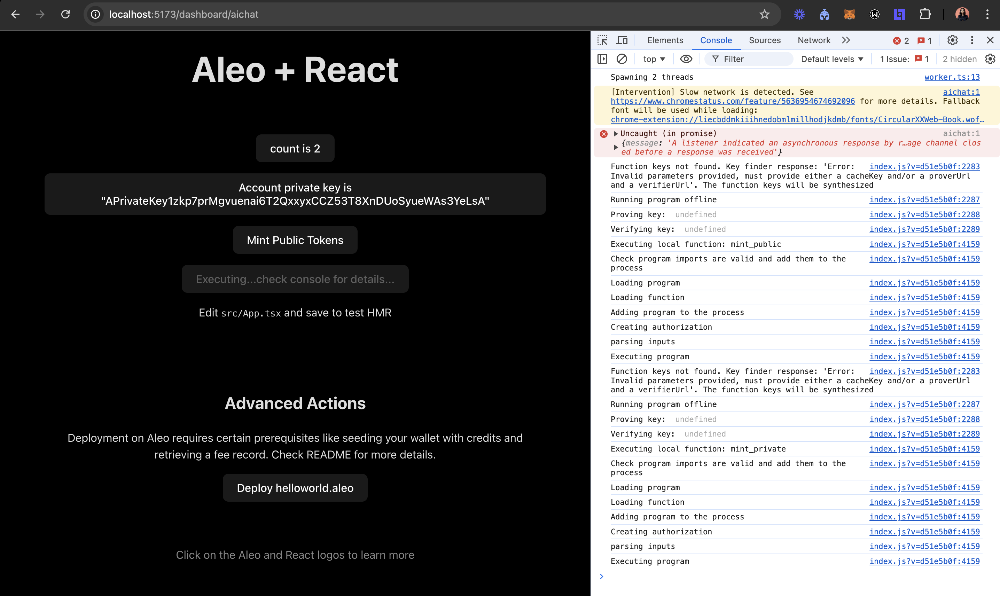
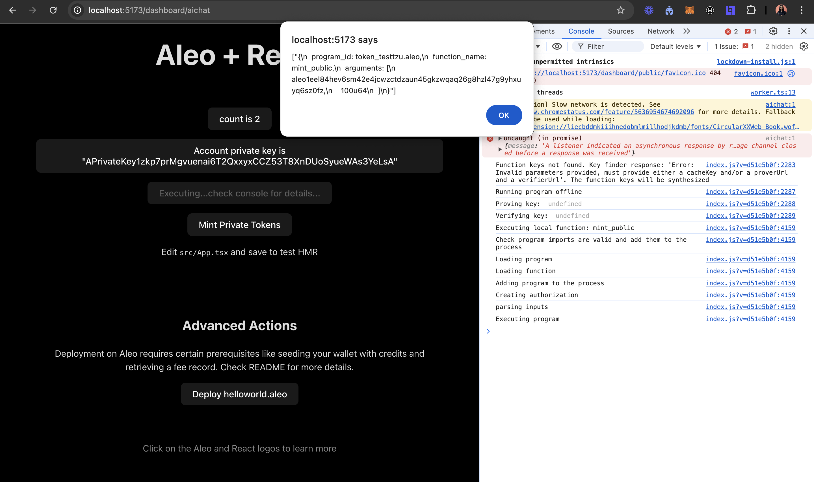

# Usecases of ZK for women

## ZK Safe Participation in Online Platforms: Protecting Women's Identities

Zero-Knowledge (ZK) technology offers women the opportunity to engage in online communities and social platforms while maintaining their privacy. This approach allows users to verify their identities without revealing personal information, effectively creating what can be referred to as a "stealth address." Such a mechanism significantly reduces the risks of harassment and discrimination that can arise from being publicly identifiable.

By leveraging ZK, women can participate in discussions, share insights, and contribute to various platforms without the fear associated with exposing their identities. This anonymity creates a safer environment for self-expression, enabling individuals to focus on content and interactions rather than concerns about their safety.

Moreover, ZK technology enhances women's participation in decentralized finance (DeFi) and Web3 applications, where financial transactions are often linked to personal identities. This layer of anonymity not only protects against targeted harassment but also empowers women to engage in financial ecosystems that have historically been male-dominated.

The implementation of ZK in online platforms represents a significant step toward fostering inclusive and equitable digital spaces. By adopting ZK solutions, developers and community leaders can help ensure that women and other marginalized groups can participate freely, enriching the discourse and diversity within online communities.

## Screenshots

---
